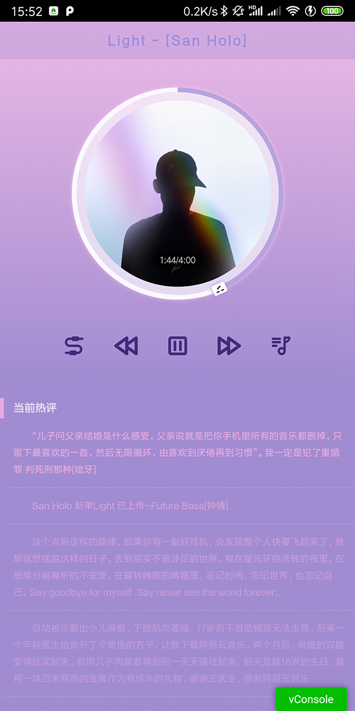

# 我的音乐小站 ？？
## hybrid 模式开发 
## Vue 嵌入 cordova 实现音乐小站

## 简介
调用 网易云 接口
> 简介    通过网易云专辑ID 获取音乐列表 然后播放   `(换个地方播放音乐的感觉)`  

> `地址` http://music.ncgame.cc/  
> apk下载请看 release  

> 技术栈 Vue + Vue-router + axios + cordova  

> 基于DOM 实现圆形进度条  
> 进度条原理： 一个全圆三个半圆（两个用于转动一个用于不让其他两个圆转动回来）  
> 先转一个半圆如果半圆转到了180度就启用另一个半圆两个半圆同时转动
> 不懂可以联系 `1450941858@qq.com`

## 开发者？
> vconsole 可在 main.js 中处理掉  
#### ./hybrid 为 cordova 主程序  
> 进入hybrid 可运行 `cordova run android` or  `cordova run browser` 即可运行在对应平台  
#### . 为主程序  
> `npm run dev` 开启服务  
> `npm run build` 构建页面 打包地址改为 ./hybrid/www

## 展示

